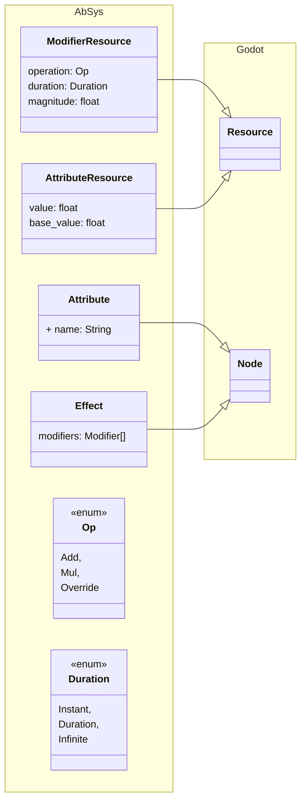

# AbSys

> ⚠️ This is a WIP repo for a Godot plugin. Do not expect any useful features at this point.

A gameplay ability system for Godot, heavily inspired by the Gameplay Ability System (GAS) in Unreal.

## Planned features

AbSys aims to provide a framework for:
	
* **Attributes** representing meaningful resources for game entities.
* **Effects** that modify attributes.
* **Abilities** that can be granted and activated by game entities, applying effects to any attribute-haver.

