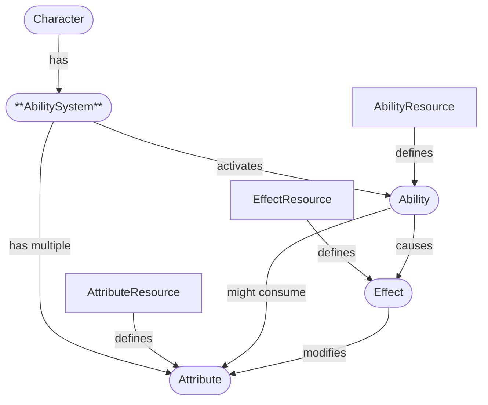
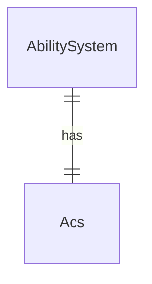

# Abilute

> ⚠️ This is a WIP repo for a Godot plugin used for my personal projects. Do not expect any useful features at this point.

**Abilute** (portmanteau of *ability* and *attribute*) is a gameplay ability plugin for Godot, heavily inspired by the Unreal Gameplay Ability System (GAS).
 
## Planned features

**Abilute** aims to provide a framework for:
	
* **Attributes** representing meaningful resources for game entities.
* **Effects** that modify attributes.
* **Abilities** that can be granted and activated by game entities, applying effects to any attribute-haver.

## Design overview

